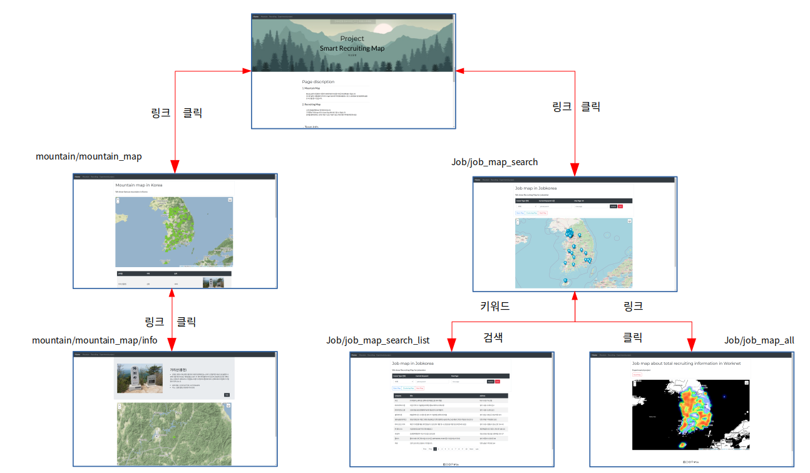
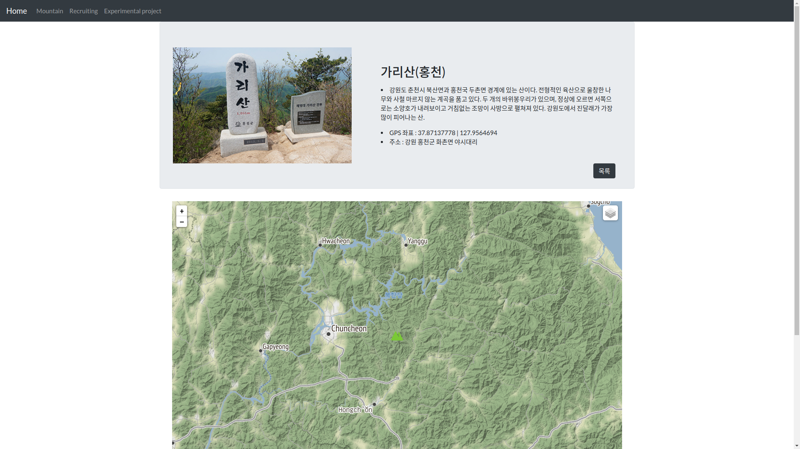

# smart_recruiting_map  
### 팀명 - 위오동맹

 
본 프로젝트는 한국전파진흥협회 에서 진행되는 '5G 영상처리를 활용한 AI 자율비행 통제시스템' 에서 진행되었습니다.

총 2가지를 주제로 제작되었으며 주제는 아래와 같습니다.
  

    공통 주제 - 100대 명산 맵과 정보 리스트

    팀 주제 - 구직정보 데이터를 기반한 맵

  
프로젝트의 개발환경은 아래와 같습니다.

    OS : ubuntu 20.04
    언어 : Python, html
    프레임워크 : Django, BootStrap
    데이터베이스 : MongoDB(Docker)
    편집기 및 디버거 - Visual studio code
    파이썬 라이브러리 - Django,selenium,folium,bs4,
                       requsts,pymongo,pandas,urllib

 

# Index 

1. 스토리 보드

2. 페이지 구도

3. 페이지 상세설명
 
 
 

## 1.스토리 보드

본 페이지는 django 를 통해 제작되었으며, 2개의 주제에 해당하는 App을 구성 하였습니다.
크게 아래의 구도로 이어집니다.

 

    Homepage/ ㅡ mountain/ ㅡ mountain_map/ ㅡ info/
              ㄴ  Job/     ㅡ job_map_search/
                           ㄴ job_map_all/

 
 
이미지로는 다음과 같습니다

메인 페이지로부터 왼쪽은 100대 명산을 위한 App 이며 오른쪽은 구직정보를 기반으로 한 map 을 위한 APP 입니다.

공통으로는 Navivar 를 통해 mainpage, /moutain/moutain_mapp, /Job/job_map_search, /Job/job_mal_all 

까지 접속이 가능합니다.

 
 
 
 

# 2. 페이지 구도

 
 

### 1. 메인 페이지

 
 

    메인 페이지에서는 구성된 2개의 앱에 대한 간단한 설명과 팀원이 한 작업에 대해 설명하고있습니다.
    Navar 를 통해서도 2개의 앱에 각각 접속이 가능하며, 아래 page discription 을 통해 접속이 가능합니다.

 
 

### 3. Mountain map

 

Moutain Map 은 Blackyak과 산림청에서 지정한 100대 명산에 대한 정보를 정리하고, 이를 모아놓은 맵을 나타낸 페이지입니다.

가장 처음 페이지에 접속하면 아래와 같이 100개의 명산위치를 아이콘으로 표시한 맵이 나옵니다.

  

 
 

맵 하단에는 산에 대한 정보를 간략이 정리해 둔 리스트가 나와있습니다. 
리스트를 클릭하면 아래와 같은 페이지가 나오며, 산에 대한 대략적인 설명과 GPS 좌표 및 주소를 표시하였고, 맵에 해당하는 위치가 Zoom 이 됩니다.

 
 

 

